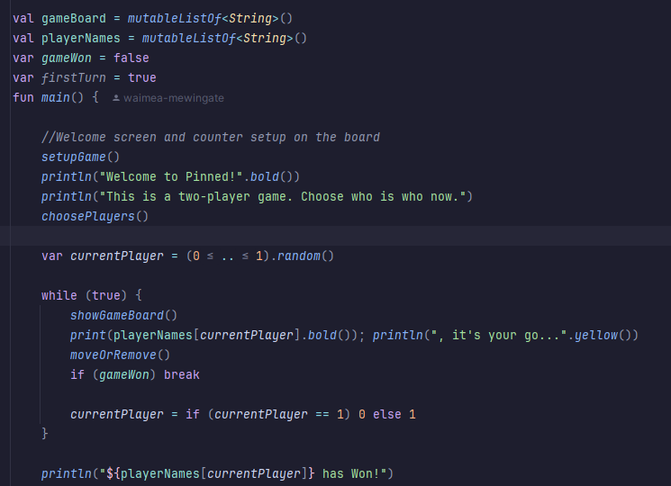
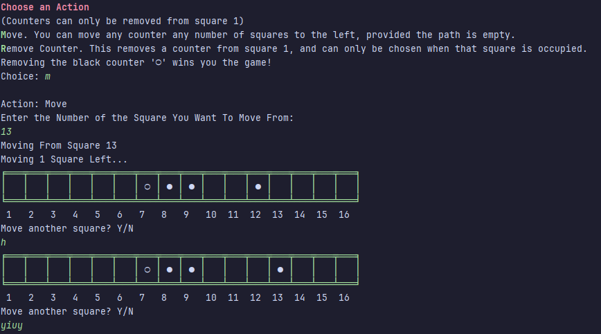
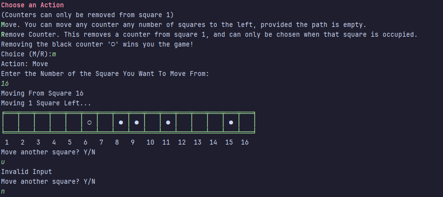
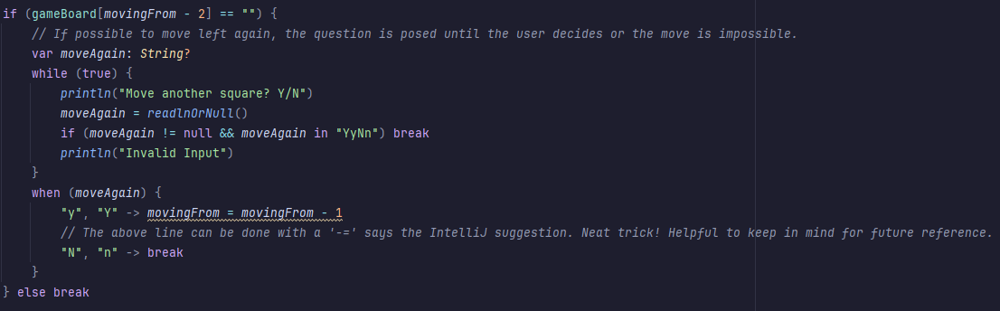

# Development Log

The development log captures key moments in your application development:

- **Design ideas / notes** for features, UI, etc.
- **Key features** completed and working
- **Interesting bugs** and how you overcame them
- **Significant changes** to your design
- Etc.

---

## Date: 31/03/2026

I  had a bunch of bugs with my code - got them fixed with help by the teacher v
### Here's the code that doesn't work
val player1 = playerNames[0] \
val player2 = playerNames[1] \
var startingPlayer = playerNames.random() \
print("Starting Player: ".yellow()); println(startingPlayer.bold()) \
var turn = String\
turn = when (startingPlayer = playerNames[0]) { \
    turn = player1 \
    else -> turn = player2 \
} \
while (true) { \
    if (firstTurn) { \
        turn = startingPlayer \
    }\
    else if (turn = player1) {\
    turn = player2 \
    else (turn = player1) } \
if (gameWon) break \
} \
### This is what it looks like fixed

---

## Date: 21/04/2026

It appears that when an incorrect value is input for moving again, the counter moves back/ gets swapped back with the square it came from, as the move function is essentialy swapping the counters. This is shown in the below screenshot- look at the two gameboards. In the first, the counter was on square 13 but is shown here after being moved 1 square left, to square 12. After the response to the Y/N is input as "h", the counter swaps back. 

I have fixed this issue by adding error-checking. If the answer is not in "YyNn" the code will simply say "Invalid Input" and ask again. This way, it will only move again if the input is 'y' or 'Y'. 

### Here is the code: 

---

## Date: xx/xx/20xx

Example description and notes. Example description and notes. Example description and notes. Example description and notes. Example description and notes. Example description and notes.

---

## Date: xx/xx/20xx

Example description and notes. Example description and notes. Example description and notes. Example description and notes. Example description and notes. Example description and notes.

---

## Date: xx/xx/20xx

Example description and notes. Example description and notes. Example description and notes. Example description and notes. Example description and notes. Example description and notes.

---

