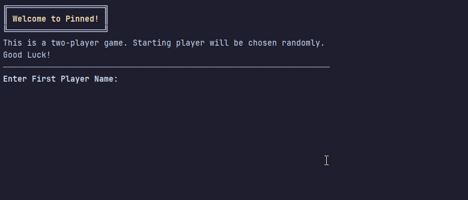
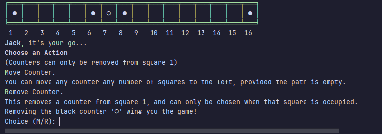
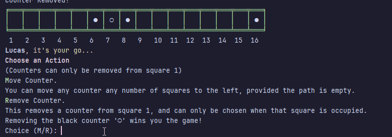
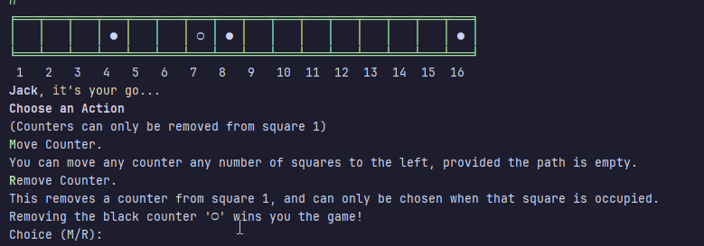

# Results of Testing

The test results show the actual outcome of the testing, following the [Test Plan](test-plan.md)

---

## User Input - Valid Player Names

I will test that player names will be accepted.

### Test Data To Use

I will try to enter a valid name for each player (not blank) - **Lucas**, **Jack**

### Test Result

The names were accepted. 

---

## User Input - Invalid Names (Blank)

I will test that invalid (blank) names are rejected by the game.

### Test Data To Use

I will attempt to enter blank names for both players (invalid.)

### Result

 \
The blank names were rejected. 

---

## User Input - Choosing Actions - Removing a Counter (Valid)

I will test that the choice to remove a counter when it is present on square 1 is accepted.

### Test Data To Use

I will attempt to make a valid choice - which to remove a counter is only accepted by the game if the input is **R** (in either lowercase or capital.) \
I will repeat both choices for both players.

### Result

The game accepted the valid choice. 

---

## User Input - Choosing Actions - Removing a Counter (Invalid)

I will test that the choice to remove a counter will reject invalid input.

### Test Data To Use

I will try to input an invalid choice. To do this I will try the following -
- Inputting a blank
- Inputting a letter outside the accepted letters - " a ", and " f "
- Inputting a number (46)
- Inputting a word - "box."

I will also attempt to input 'R' as a choice when no counter is on square 1.

I will repeat this for both players.

### Result

The game rejected the invalid input. \

---

## User Input - Choosing Actions - Valid and Invalid (Moving)

I will test that valid choices are accepted and invalid choices are rejected when choosing whether to move or remove a counter.

### Test Data To Use (Invalid)

I will attempt to make a choice that is invalid first, by trying to input anything that is not within the valid choice of "m", "M", "r", or "R". \
I will try to input **hello**, **15**, and a **blank** input - these I expect to be rejected. \
\
This will be repeated for both players.

### Result

The game rejected these examples. \
 \
First Player ^
---
 \
Second Player ^

### Test Data To Use (Valid)

I have four choices that will be accepted in order for the game to progress- the letters 'M' and 'R'- both in lowercase and capital. \
The choice to move is only accepted when the input is (either capital or lowercase) **m** - so I will enter these for both players.

### Result

The game accepted my input. \

 \
First Player ^
---
 
Second Player ^

---

---

