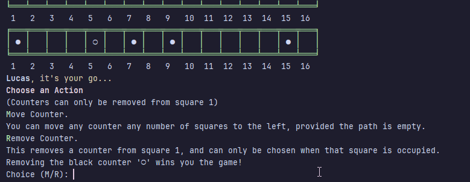
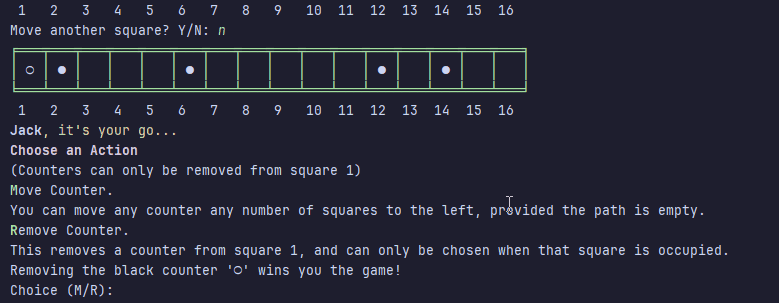
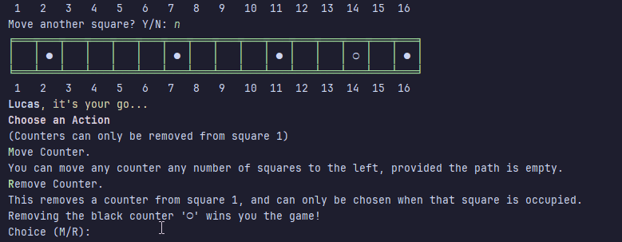
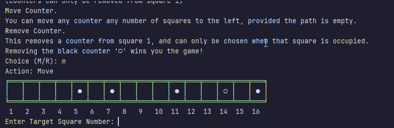
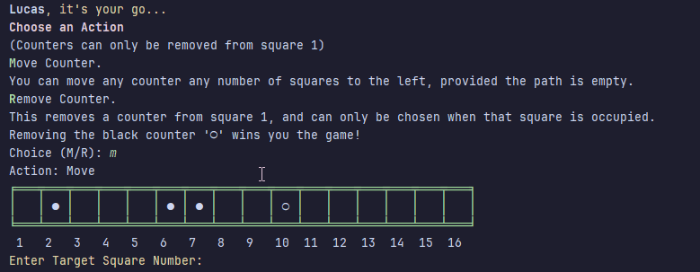

# Results of Testing

The test results show the actual outcome of the testing, following the [Test Plan](test-plan.md)

### Any strange marks or flashes in the gif recordings were from my clicking, not any problems with the game.
I am happy that I have managed to get through this! Testing went as I'd hoped. 

---

## User Input - Valid Player Names

I will test that player names will be accepted.

### Test Data To Use

I will try to enter a valid name for each player (not blank) - **Lucas**, **Jack**

### Test Result

 \
The names were accepted. 

---

## User Input - Invalid Names (Blank)

I will test that invalid (blank) names are rejected by the game.

### Test Data To Use

I will attempt to enter blank names for both players (invalid.)

### Result

 \
The blank names were rejected. 

---

## User Input - Choosing Actions - Removing a Counter (Valid)

I will test that the choice to remove a counter when it is present on square 1 is accepted.

### Test Data To Use

I will attempt to make a valid choice - which to remove a counter is only accepted by the game if the input is **R** (in either lowercase or capital.) \
I will do this for both players.

### Result

 \

The game accepted the valid choice. 

---

---

## User Input - Choosing Actions - Removing a Counter (Invalid)

I will test that the choice to remove a counter will reject invalid input.

### Test Data To Use

I will try to input an invalid choice. To do this I will try the following -
- Inputting a blank
- Inputting a letter outside the accepted letters - " a ", and " f "
- Inputting a number (46)
- Inputting a word - "box."

I will also attempt to input 'R' as a choice when no counter is on square 1.

I will repeat this for both players.

### Result

The game rejected the invalid input. \
 
---

---

## User Input - Choosing Actions - Valid and Invalid (Moving)

I will test that valid choices are accepted and invalid choices are rejected when choosing whether to move or remove a counter.

### Test Data To Use (Invalid)

I will attempt to make a choice that is invalid first, by trying to input anything that is not within the valid choice of "m", "M", "r", or "R". \
I will try to input **hello**, **15**, and a **blank** input - these I expect to be rejected. \
\
This will be repeated for both players.

### Result

The game rejected these examples. \
 \
First Player ^
---
 \
Second Player ^

### Test Data To Use (Valid)

I have four choices that will be accepted in order for the game to progress- the letters 'M' and 'R'- both in lowercase and capital. \
The choice to move is only accepted when the input is (either capital or lowercase) **m** - so I will enter these for both players.

### Result

The game accepted my input. 

 \
First Player ^
---
 \
Second Player ^

---

## User Input - Moving - Counter Selection (Valid)

I am going to test that counters can be properly selected in order to move them.

### Test Data To Use

I am going to input the number of a square on the board containing a counter. \
Valid squares both contain a counter and have an empty square to the left of them. \
\
I will do this for both players.

### Result

The game accepted my input and moved the counter. \

---

## User Input - Moving - Counter Selection (Invalid)

I am going to test that invalid counter selection is rejected.

### Test Data To Use

I will attempt to enter -
- A blank value
- A word ("**green**")
- A number out of range (-3, 99)
- A square containing a counter but with no empty square on the left to move into
- A square in range but without a counter in it.

I will do this for both players.

### Expected Result

The game rejected the invalid inputs. \

---

## User Input - Moving - Counter Selection (Boundaries)

I am going to test the boundary values of my game.

### Test Data To Use

I will attempt to enter the numbers of the squares on each end of my game board - first **1** and then **2**, followed by **16** \
provided they have empty squares to their left.

### Result

Square 1 was rejected as invalid (as expected.) Squares 2 and 16 both were selected successfully and their counters moved. \

---

## Moving - User Input and Gameplay

### Test Data To Use (User Input)

Once 'Move' has been successfully selected, the target counter moves one square and then asks for user input to move again. \
I will test invalid values first
- A blank
- A number (12)
- A word (banana)

These I expect to be rejected.

I will then attempt to enter valid data - "Y", and "N". These I expect to be accepted, with Y moving the counter another square left and N ending the turn.

### Gameplay

When "Move" is initially chosen, the targeted counter should move 1 square left. The same should happen again when 'Y' is selected. \
The turn should end when either 'N' is selected when move again is asked, or when there is no valid square to move to. 

### Results 

The valid inputs were accepted, the invalid rejected, and gameplay as expected. \

---

## Gameplay 

### Game Start/Setup

The game set up as expected. \

### Counter Removal

When the choice of "remove counter" is selected, the game should remove the counter from square 1 and end the current turn. \

### Winning

The game should detect a win when the 'black' counter ( ○ ) is removed from the first square. No more turns should be announced, and the game should end. 
The player whose turn it was should be announced as the winner.

\
 \
This happened as expected.

---
