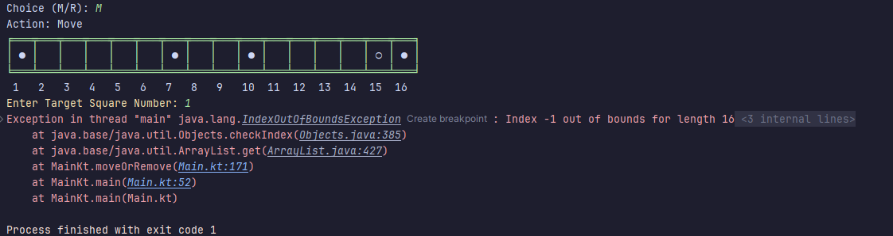
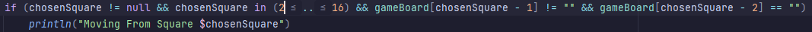
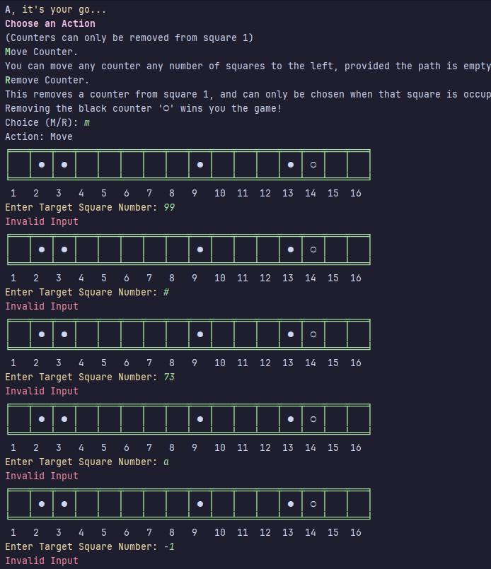

# Results of Testing

The test results show the actual outcome of the testing, following the [Test Plan](test-plan.md)

---

## Boundary Test
Running the code and inputting values that I believe will be invalid to choose when moving. 

### Test Data Used

### Test Result

Telling the program to move from square 1 did indeed give me an error and cause the game to stop. \
Luckily this only required changing the range on my error-testing 'if' line to not include square 1.\

### Other tests all returned invalid as expected. 
 

I believe this test is successful as I have fixed the boundary error, and my error-checking catches all other values such as ones outside the range of squares 2..16, as well as characters and letters.

---

## Example Test Name

Example test description. Example test description.Example test description. Example test description.Example test description. Example test description.

### Test Data Used

Details of test data. Details of test data. Details of test data. Details of test data. Details of test data. Details of test data. Details of test data.

### Test Result

Comment on test result. Comment on test result. Comment on test result. Comment on test result. Comment on test result. Comment on test result.

---

